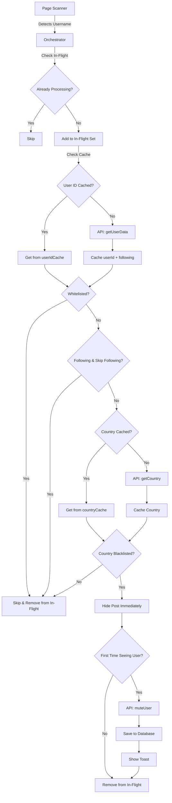

xBlockOrigin is a browser extension that automatically mutes X.com users from specified countries using X's GraphQL APIs, persistent caching, and local storage.

## Extension components

The extension consists of four main architectural components:

### Content scripts

Content scripts run directly on X.com pages and handle DOM scanning and user detection:

- **orchestrator.ts** - Main processing logic that coordinates all scanning operations
- **timelineScanner.ts** - Scans the home timeline for user posts
- **searchScanner.ts** - Scans search results pages
- **statusScanner.ts** - Scans post detail pages with replies
- **replyScanner.ts** - Scans notifications and replies
- **profileScanner.ts** - Scans user profile pages
- **postHider.ts** - Applies visual overlay to hide posts from blacklisted users
- **flagInjector.ts** - Injects country flags next to usernames (optional)

<Note>
Content scripts have access to the page's DOM but run in an isolated JavaScript context separate from the page's scripts.
</Note>

### Background worker

The background service worker (Manifest V3) or persistent background page (Manifest V2) handles:

- Extension lifecycle management
- Cross-tab communication
- Storage access coordination

<Warning>
Chrome/Edge use Manifest V3 with a service worker, while Firefox uses Manifest V2 with a persistent background page.
</Warning>

### Popup UI

Preact-based popup interface providing:

- Country blacklist management
- Whitelist management (WhitelistManager.tsx)
- Settings configuration (Settings.tsx)
- Muted users database viewer
- CSV export functionality
- Statistics dashboard

### Utilities layer

Shared utilities used across components:

- **cache.ts** - Persistent TTL-based caching (24h for countries, 5m for following)
- **rateLimit.ts** - API request queue with sequential processing
- **csvExporter.ts** - Export muted users to CSV format

## Architecture flow

The orchestrator coordinates the entire user processing pipeline:

### Processing steps

1. **Page scanning** - Scanner detects username and tweet element on current page
2. **In-flight check** - Prevents duplicate processing of same user
3. **User data fetch** - Gets `userId` and `following` status (cached 24h / 5m)
4. **Whitelist check** - Skips if user is whitelisted
5. **Following check** - Optionally skips users you follow (default)
6. **Country detection** - Fetches country from X.com API (cached 24h)
7. **Blacklist check** - Checks if country is in blacklist
8. **Post hiding** - Immediately applies 50% opacity + 8px blur overlay
9. **API mute** - Calls X.com's mute API (only for new users)
10. **Database save** - Stores muted user with timestamp

<Note>
The orchestrator uses an in-flight tracking set to prevent race conditions when the same user appears multiple times on the page.
</Note>

## Page detection

The orchestrator detects which X.com page is currently active and starts appropriate scanners:

<ParamField path="timeline" type="scanner">
  Home timeline (`/home` or `/`) - scans timeline posts
</ParamField>

<ParamField path="search" type="scanner">
  Search results (`/search`) - scans search result tweets
</ParamField>

<ParamField path="notifications" type="scanner">
  Notifications page (`/notifications`) - scans replies and mentions
</ParamField>

<ParamField path="status" type="scanner">
  Post detail page (`/{username}/status/{id}`) - scans main post and replies
</ParamField>

<ParamField path="profile" type="scanner">
  User profile pages (`/{username}`) - scans user's tweets
</ParamField>

## Navigation handling

The extension monitors for navigation events using:

- **popstate event** - Detects browser back/forward navigation
- **URL polling** - Detects SPA navigation (100ms interval)
- **Scanner cleanup** - Clears old scanners and API queue on navigation

<Warning>
The API request queue is cleared on navigation to prevent processing users from the previous page.
</Warning>

## Multi-browser support

xBlockOrigin supports both Chrome/Edge and Firefox with different manifest versions:

| Browser | Manifest | Background Type |
|---------|----------|----------------|
| Chrome/Edge | V3 | Service worker |
| Firefox | V2 | Persistent background page |

The codebase uses the `chrome.*` APIs which are supported by both browsers through WebExtensions API compatibility.
